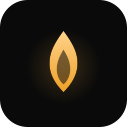

<div align="center">



# Vigil

**A live performance instrument for macOS and iPad**

A sustained tonal pad, an eight pad drum sampler, a metronome and MIDI, in one window built
for a dark stage.

[](LICENSE)


</div>

Vigil is not distributed through any store. The source lives here and you build it on your own
machine, the way an Electron app ships its source. Ad-hoc signing, no developer account needed.

## What it does

- **Tonal pad.** Twelve chromatic notes, one sounding at a time, looped, with an equal-power
  crossfade on the change. Every note is its own recording, so nothing is pitch shifted.
- **Drum pads.** Eight one-shots with immediate retrigger, eight voices each so a fast repeat
  rings over the last one instead of cutting it, and a play mode per pad, the way a drum
  program has it: overlap, or restart for a long one-shot you do not want stacking. Per pad
  volume and colour, and a hard stop that leaves the tonal pad playing.
- **Kits and sets.** A kit owns the eight pads; a set carries the tonal sound, the filters, the
  metronome and which kit is active. Both save themselves as you work.
- **Metronome.** 20 to 300 BPM, six time signatures, tap tempo, four click sounds, accent on
  the downbeat, double time. Scheduled ahead in sample time rather than off a UI timer, and
  refilled from outside the main actor, so a busy interface cannot silence the count.
- **MIDI.** CoreMIDI input with hot-plug, a channel filter, and MIDI Learn over every pad,
  every live control and the metronome. Computer keys and MIDI share one mapping table, and
  each target holds one of each.
- **Seven themes**, four dark and three light, plus one that follows the system.
- **Four languages**: Portuguese, English, Spanish and French, switchable without a restart.

## Requirements

- Xcode 26 with the Swift 6 toolchain, to build
- macOS 14 or later, or iPadOS 17 or later, to run
- [XcodeGen](https://github.com/yonaskolb/XcodeGen): `brew install xcodegen`

The `.xcodeproj` is generated, not committed. `VigilApp/project.yml` is the source of truth.

## Build and run

```bash
./scripts/build.sh --open
```

That generates the project, builds for macOS and opens the app. Drop `--open` to build only.

To work in Xcode instead:

```bash
cd VigilApp && xcodegen && open Vigil.xcodeproj
```

## Tests

```bash
cd VigilApp
xcodebuild test -project Vigil.xcodeproj -scheme VigilTests -destination 'platform=macOS'
```

74 tests. The audio ones measure the rendered signal rather than checking that a function was
called, because every audio bug in this project so far has been silent: it compiled, it ran,
and nothing came out. Timing is measured by rendering the graph offline, sample by sample,
with no wall clock involved.

## Installable builds

```bash
./scripts/package.sh          # both
./scripts/package.sh --mac    # dmg only
./scripts/package.sh --ios    # ipa only
```

Artefacts land in `dist/`.

**macOS.** Open the `.dmg` and drag Vigil to Applications. The build is ad-hoc signed, so the first launch needs right-click then Open, or:

```bash
xattr -dr com.apple.quarantine /Applications/Vigil.app
```

**iPad.** The `.ipa` is unsigned on purpose. Install it with
[Sideloadly](https://sideloadly.io) or [AltStore](https://altstore.io), which re-sign it with your own Apple ID. A free account expires after seven days and needs a refresh.

## Repository layout

```
VigilApp/
  project.yml            XcodeGen manifest, the source of truth for the project
  Sources/
    App/                 AppModel and its per-topic extensions, settings, entry point
    Audio/               One AVAudioEngine shared by drums, tonal pad and metronome
    Midi/                CoreMIDI input and the key/note mapping table
    Library/             Sample import, user kits, sets, factory catalogue
    Design/              Theme tokens, shared chrome, toasts
    Features/            Home, settings, MIDI and management screens
  Resources/
    Audio/               Factory pad sounds, drum kits and metronome clicks
    Localizable.xcstrings
  Tests/
scripts/
  build.sh               Generate, build, optionally open
  package.sh             Build a dmg and an unsigned ipa
  make-icon.swift        Redraw the app icon from CoreGraphics
assets/                  Logo and icon as SVG
```

## Importing your own samples

Pick **Sample Drum → Import Sample…**, then right-click a pad to assign it. The file is copied
into the app while the security scope is open, which is why a read-only entitlement is enough.

If a file lives in iCloud and has not been downloaded yet, the import will say so rather than
failing quietly.

## Design notes

Three decisions worth knowing before reading the code:

**One audio engine.** Drums, tonal pad and metronome all hang off a single `AVAudioEngine` at
the smallest stable IO buffer, 128 frames. Nothing allocates or reads from disk on the trigger path; buffers are preloaded.

**The kit owns the pads.** A set points at a kit rather than copying it, so the same state
never exists in two places and editing a kit applies everywhere it is used.

**Player time, not node time.** The metronome schedules ahead against the player's own
timeline, and keeps its beat accumulator in `Double`. Truncating it costs about 76 ms of drift
over half an hour at 128 BPM, which is inaudible in a rehearsal and obvious in a set.

## Licence

Apache 2.0. See [LICENSE](LICENSE).
